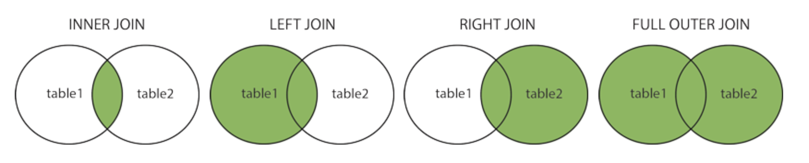

SQL
===

SELECT
------

Select specific columns from a table:

```sql
SELECT column1, column2, ...
FROM table_name;
```

Select all columns from a table:

```sql
SELECT *
FROM table_name;
```

Select distinct returns only distinct (different) values, so no column contains duplicate values:

```sql
SELECT DISTINCT column1, column2, ...
FROM table_name;
```

Syntax varies by database, but in MySQL and PostgreSQL, you can also limit the number of columns returned by a select statement with a `LIMIT` clause:

```sql
SELECT *
FROM table_name
LIMIT number;
```

WHERE
-----

The where clause is used to filter records based on some conditions. It's not just used for select statements, but also update, delete, and so on:

```sql
SELECT *
FROM table_name
WHERE condition;
```

### WHERE clause operators

| Operator | Description                        |
| -------- | ---------------------------------- |
| =        | Equal                              |
| >        | Greater than                       |
| <        | Less than                          |
| >=       | Greater than or equal to           |
| <=       | Less than or equal to              |
| <> or != | Not equal                          |
| BETWEEN  | Within a range, `BETWEEN x AND y`  |
| LIKE     | Search for a pattern, `LIKE 'y%s'` |
| IN       | Within a set, `IN (x, y, z)`       |

You can combine or negate where conditions with `AND`, `OR`, and `NOT` operators:

```sql
SELECT *
FROM table_name
WHERE condition AND (condition OR condition);
```

```sql
SELECT *
FROM table_name
WHERE NOT condition;
```

ORDER BY
--------

Order by is used to sort the result set in ascending or descending order using a specified column:

```sql
SELECT *
FROM table_name
ORDER BY column1, column2, ... ASC|DESC;
```

In this example it will sort by `column1`, but use `column2` as a secondary sort value if the values of `column1` happen to match.

By default, order by sorts in ascending (`ASC`) order.

INSERT INTO
-----------

To insert new records into a table:

```sql
INSERT INTO table_name (column1, column2, column3, ...)
VALUES (value1, value2, value3, ...);
```

You can omit the column list if you're inserting values for every column. Be sure that your value order matches the column order, however.

UPDATE
------

To modify existing records in a table:

```sql
UPDATE table_name
SET column1 = value1, column2 = value2, ...
WHERE condition;
```

Be careful, if you omit the `WHERE` clause, _all_ records in the database will be updated!

DELETE
------

To delete existing records in a table:

```
DELETE FROM table_name
WHERE condition;
```

Again, be careful – if you forget the `WHERE` clause, _all_ records will be deleted. There are times you may want to do this, will still preserving the table (for example to delete test data).

MIN, MAX, COUNT, AVG, SUM
-------------------------

These are _functions_ that operate on column values.

The min function returns the smallest value of the selected column, and max returns the biggest:

```sql
SELECT MIN(column_name), MAX(column_name
FROM table_name;
```

Count returns the number of rows returned by a query:

```sql
SELECT COUNT(column_name)
FROM table_name
WHERE condition;
```

Average returns the average value of a _numeric_ column:

```sql
SELECT AVG(column_name)
FROM table_name
WHERE condition;
```

Sum returns the total sum of a _numeric_ column:

```sql
SELECT SUM(column_name)
FROM table_name
WHERE condition;
```

LIKE
----

The like operator is used in where clauses to match column values against patterns.

Two common wildcards are used in these patterns:

* `%` Zero, one, or more characters.
* `_` One single wildcard character.

```sql
SELECT column1, column2, ...
FROM table_name
WHERE column1 LIKE pattern;
```

ALIASES
-------

Aliases allow you to give tables or columns a temporary name.

```sql
SELECT column_name AS alias_name
FROM table_name;
```

```sql
SELECT column_name
FROM table_name AS alias_name;
```

JOIN
----

A join clauses combines rows from two or more tables, using a shared column between them.

```sql
SELECT Orders.OrderID, Customers.CustomerName, Orders.OrderDate
FROM Orders
JOIN Customers ON Orders.CustomerID=Customers.CustomerID;
```

There are four different kinds of joins:

* `(INNER) JOIN` Returns records that have matching values in both tables.
* `LEFT JOIN` Returns _all_ rows from the left (first) table, _and_ the matched rows from the right (second) table.
* `RIGHT JOIN` Returns _all_ rows from the right (second) table, _and_ the matched rows from the left (first) table.
* `FULL JOIN` Returns _all_ rows from _both_ the right and left tables.



UNION
-----

The union operator is used to combine the result set of two or more select statements.

To work, the result sets must have the same column number, type, and order.


```sql
SELECT column1, column2, ...
FROM table1
UNION
SELECT column1, column2, ...
FROM table2;
```

GROUP BY
--------

The group by statement allows you to group rows that have the same values into summary rows, usually in conjunction with aggregate functions like count, max, min, and so on.

```sql
SELECT column1, column2, ...
FROM table_name
WHERE condition
GROUP BY column_name
```

For example, to list the number of customers in each country:

```sql
SELECT COUNT(CustomerId), Country
FROM Customers
GROUP BY Country;
```

List the number of orders by shipper:

```sql
SELECT Shippers.ShipperName, COUNT(Orders.OrderID) AS NumberOfOrders FROM Orders
LEFT JOIN Shippers ON Orders.ShipperID = Shippers.ShipperID
GROUP BY ShipperName;
```

HAVING
------

The having clause was introduced because where clauses could not be used with aggregate functions.

```sql
SELECT column1, column2, ...
FROM table_name
HAVING condition;
```

Find all countries that have at least 5 customers:

```sql
SELECT COUNT(CustomerID) CustomerCount, Country
FROM Customers
GROUP BY Country
HAVING COUNT(CustomerCount) > 5;
```

EXISTS, ANY, ALL
----------------

The exists operator tests any record exists within a subquery.

```sql
SELECT column1, column2 ...
FROM table_name
WHERE EXISTS
  (subquery)
```

For example, are there any suppliers who sell anything for less than twenty dollars?:

```sql
SELECT SupplierName
FROM Suppliers
WHERE EXISTS
  (SELECT ProductName FROM Products WHERE Products.SupplierID = Suppliers.supplierID AND Price < 20);
```

The any operator works in much the same way, but allows you to more specifically check for particular column values.

```sql
SELECT column1, column2 ...
FROM table_name
WHERE column1 operator ANY
  (subquery)
```

For example, find the name of any product we have at least ten of:

```sql
SELECT ProductName
FROM Products
WHERE ProductID = ANY
  (SELECT ProductID
  FROM OrderDetails
  WHERE Quantity = 10);
```

All works the same way as any, but only returns true if _all_ records match. This example won't return anything unless `Quantity = 10` for all records:

```sql
SELECT ProductName
FROM Products
WHERE ProductID = ALL
  (SELECT ProductID
  FROM OrderDetails
  WHERE Quantity = 10);
```

SELECT INTO
-----------

The "select into" statement copies data from one table into a new table.

```sql
SELECT column1, column2, ...
INTO new_table [IN another_db]
FROM old_table
WHERE condition;
```

You can rename columns in the new table using `AS`.

INSERT INTO SELECT
------------------

The "insert into select" statement copies data from one table and inserts it in an existing table.

```sql
INSERT INTO table2 (column1, column2, ...)
SELECT column1, column2, ...
FROM table1
WHERE condition;
```

The existing table has to have the same schema for this to work, though you can rename columns using `AS` if needed.

CASE
----

Case statements allow you to add control flow to your queries. They return the value of the first matching condition, using `ELSE` as a default.

```sql
CASE
  WHEN condition1 THEN result1
  WHEN condition2 THEN result2
  WHEN conditionN THEN resultN
  ELSE result
END;
```

Here's a practical example to show how you can use it:

```sql
SELECT CustomerName, City, Country
FROM Customers
ORDER BY
(CASE
    WHEN City IS NULL THEN Country
    ELSE City
END);
```

PROCEDURE
---------

You can store queries as "stored procedures" so they can be executed later, and even pass parameters to them. You probably won't use these too much in the real world but here are some examples. Note that exact syntax may vary by database implementation.

Simple query stored as a procedure:

```sql
CREATE PROCEDURE SelectAllCustomers
AS
SELECT * FROM Customers
GO;
```

```sql
EXEC SelectAllCustomers;
```

Parameterized procedure:

```sql
CREATE PROCEDURE SelectAllCustomers @City nvarchar(30), @PostalCode nvarchar(10)
AS
SELECT * FROM Customers WHERE City = @City AND PostalCode = @PostalCode
GO;
```

```sql
EXEC SelectAllCustomers @City = 'London', @PostalCode = 'WA1 1DP';
```

Managing Databases
------------------

Creating, dropping (deleting), and backing up a database:

```sql
CREATE DATABASE database;
```

```sql
DROP DATABASE database;
```

```sql
BACKUP DATABASE database
TO DISK = 'filepath';
```


Managing Databases
------------------

Creating, dropping (deleting), and backing up a database:

```sql
CREATE DATABASE database;
```

```sql
DROP DATABASE database;
```

```sql
BACKUP DATABASE database
TO DISK = 'filepath';
```


Managing Databases
------------------

Creating, dropping (deleting), and backing up a database:

```sql
CREATE DATABASE database;
```

```sql
DROP DATABASE database;
```

```sql
BACKUP DATABASE database
TO DISK = 'filepath';
```


Managing Databases
------------------

Creating, dropping (deleting), and backing up a database:

```sql
CREATE DATABASE database;
```

```sql
DROP DATABASE database;
```

```sql
BACKUP DATABASE database
TO DISK = 'filepath';
```


Managing Databases
------------------

Creating, dropping (deleting), and backing up a database:

```sql
CREATE DATABASE database;
```

```sql
DROP DATABASE database;
```

```sql
BACKUP DATABASE database
TO DISK = 'filepath';
```


Managing Databases
------------------

Creating, dropping (deleting), and backing up a database:

```sql
CREATE DATABASE database;
```

```sql
DROP DATABASE database;
```

```sql
BACKUP DATABASE database
TO DISK = 'filepath';
```


Managing Databases
------------------

Creating, dropping (deleting), and backing up a database:

```sql
CREATE DATABASE database;
```

```sql
DROP DATABASE database;
```

```sql
BACKUP DATABASE database
TO DISK = 'filepath';
```


Managing Databases
------------------

Creating, dropping (deleting), and backing up a database:

```sql
CREATE DATABASE database;
```

```sql
DROP DATABASE database;
```

```sql
BACKUP DATABASE database
TO DISK = 'filepath';
```

CREATE TABLE
------------

To create new table:

```sql
CREATE TABLE table_name (
    column1 datatype constraint,
    column2 datatype constraint,
    column3 datatype constraint,
   ....
);
```

Table columns may optionally have __constraints__ that enforce rules about their data. Here are some common constraints:

* `NOT NULL` The column can't be null.
* `UNIQUE` Column values must be unique within the table.
* `PRIMARY KEY` A combination of a NOT NULL and UNIQUE. Uniquely identifies each row in a table.
* `FOREIGN KEY` Prevents actions that would destroy links between tables.
* `DEFAULT value` Sets a default value for the column.


DROP and TRUNCATE
-----------------

Drop deletes a table completely:

```sql
DROP TABLE table_name;
```

Truncate deletes all a table's rows, but preserves the tables:

```sql
TRUNCATE TABLE table_name;
```

ALTER TABLE
-----------

Alter table allows you to modify an existing table.

To add columns:

```sql
ALTER TABLE table_name
ADD column_name datatype;
```

To remove columns:

```sql
ALTER TABLE table_name
DROP COLUMN column_name;
```

To modify an existing column (whether you use `ALTER` or `MODIFY` depends on implementation):

```sql
ALTER TABLE table_name
[ALTER | MODIFY] column_name datatype; -- to change the data type
```

To simply rename a column:

```sql
ALTER TABLE table_name
RENAME COLUMN old_name TO new_name;
```


